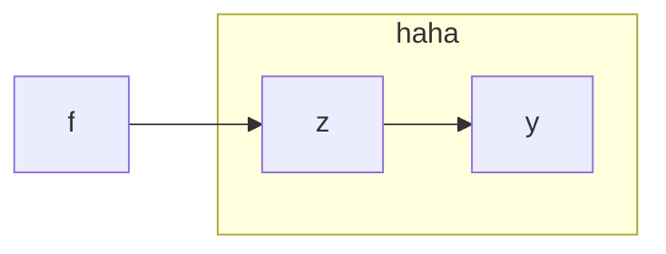
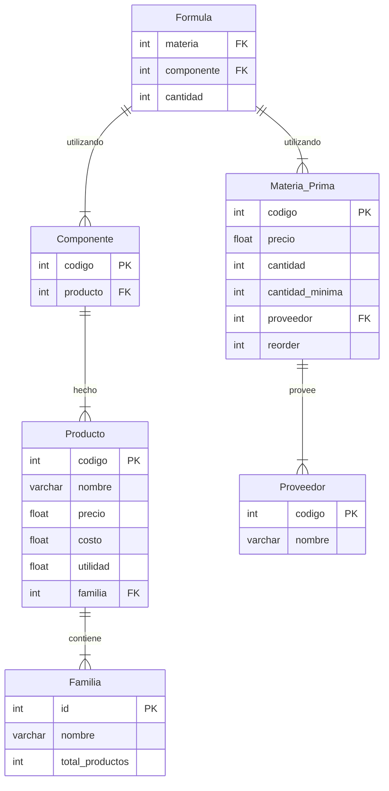
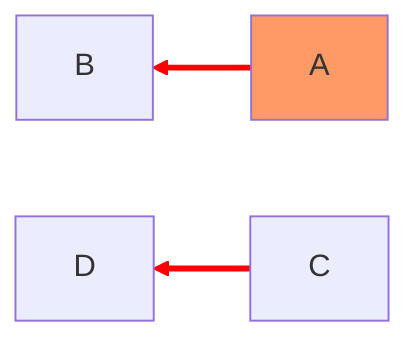

```css
.mermaid svg rect.note {
	fill: #b3aef2 !imporant;
	stroke: magenta !important;
}
```




>[! Hay que implementarlo en app]
>![[app-bases/app.sql]]

```css
.label > g > foreingObject {
	color: red;
	background-color: blue;
}

.node > g > g > foreignObject > div {
	color: green;
	stroke: blue;
}

.mermaid svg .cluster rect {
	fill: pink !important;
	stroke: yellow !important;
}

.mermaid svg .node rect {
	fill: magenta !important
	stroke: green !important;
}
```






# Requerimientos
## Departamento de Ventas:
1. Lista de precios con el siguiente formato. (Familia, Producto, nombre, precio_venta, porcentaje, precio_nuevo), ordenado por familia, producto, precio. **SOLUCIÓN:** Procedimiento almacenado p048(porcentaje_aumento float)