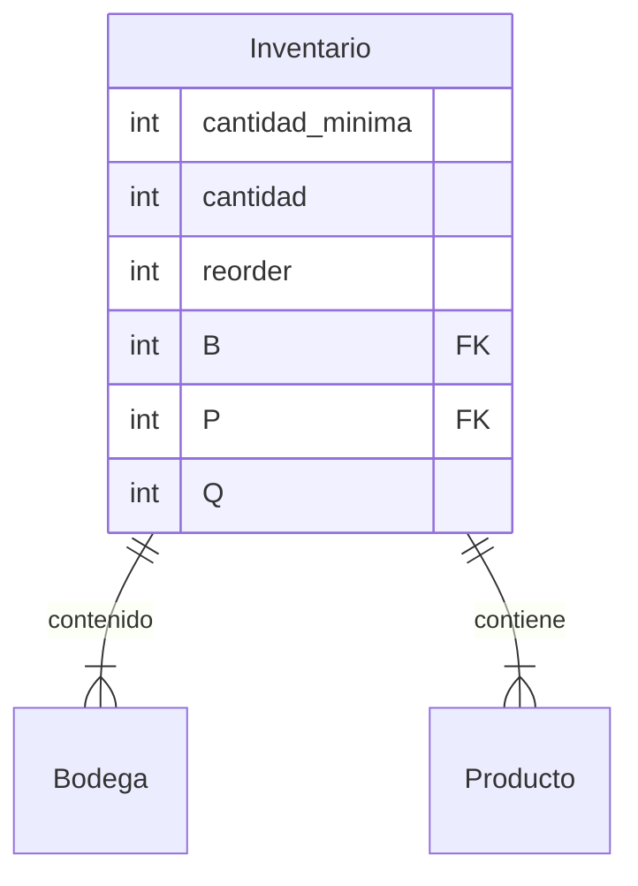
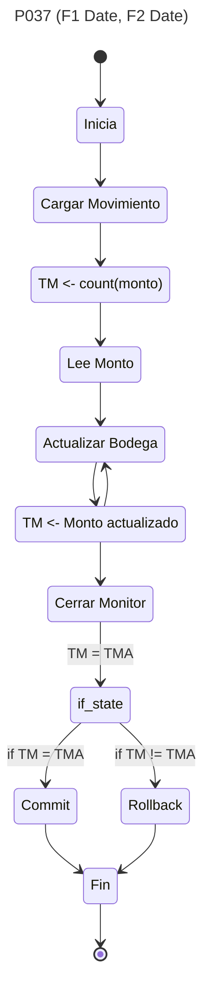
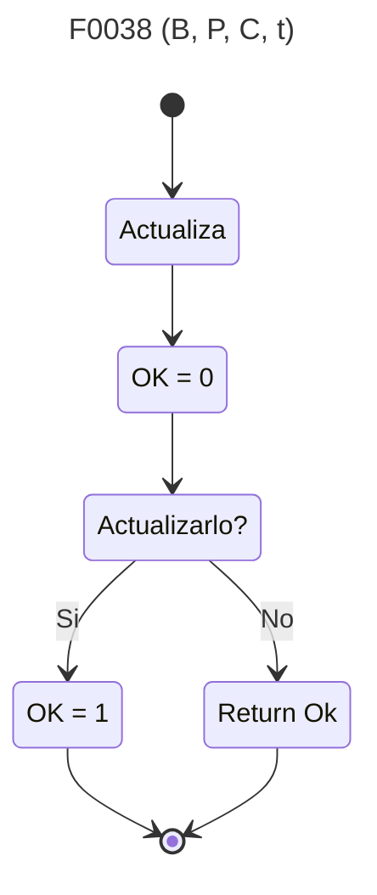

![[app.sql]]





```sql
create table Bodega (
	int codigo,
	constraint PKB PRIMARY KEY (codigo)
);

create table Producto (
	int codigo,
	constraint PKP PRIMARY KEY (codigo)
);


create table Inventario (
	int Q,
	int B,
	int P,
	int cant,
	int minim,
	int reorder,
	constraint PKI PRIMARY KEY (Q),
	constraint FK1 references Producto(P),
	constraint FK2 references Bodega(B)
);


create trigger tr027
after update on Inventario
for each row
BEGIN
	IF new.cantidad<=old.minimo
		P0075(P, reorder),
	END IF;
END;
```

